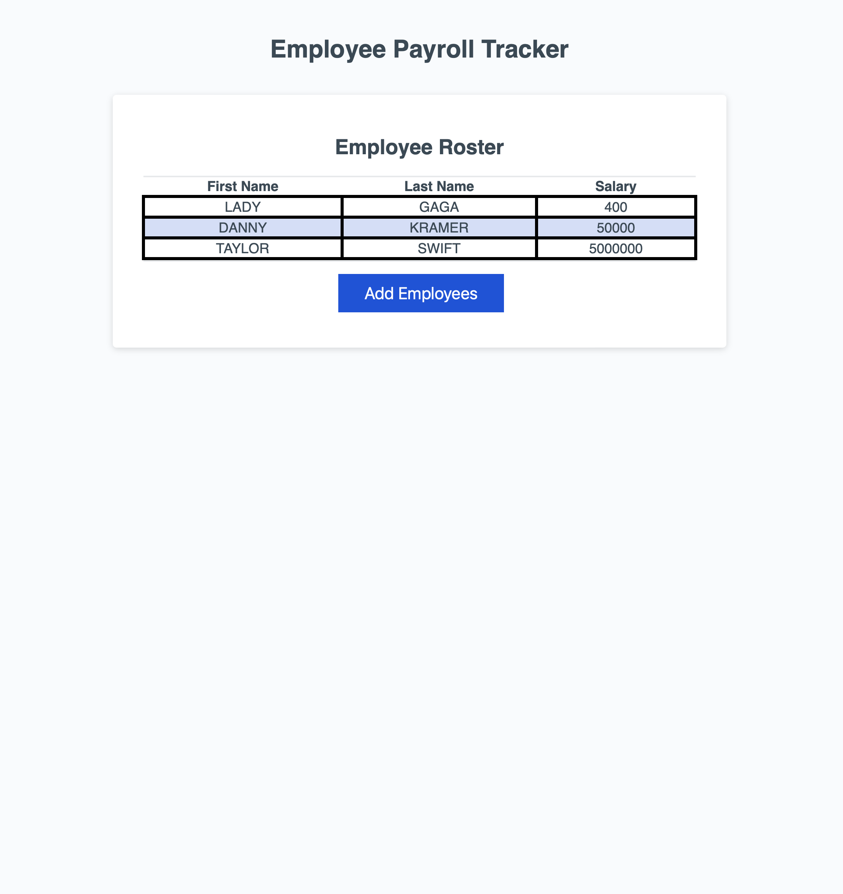

# Module3-challenge
## Project Title: Module 3 Challenge (JavaScript)

### Description: 
This repository contains the challenge for our week three bootcamp module, which involed editing pre-existing code to make an employee tracking page more interactive and intuitive. Various subjects we studied during class were helpful for this module challenge that delved deeper into JavaScript and how it brings life to webpages.  

### Included in the repository:
    - 1 READ.me file
    - 1 develop folder, containing:
        *1 index.html file
        *1 style.css sheet
        *1 script.js file, containing edited code

Credits: 
Daniel Kramer
Northwestern University Coding Bootcamp
Module 3 Challenge